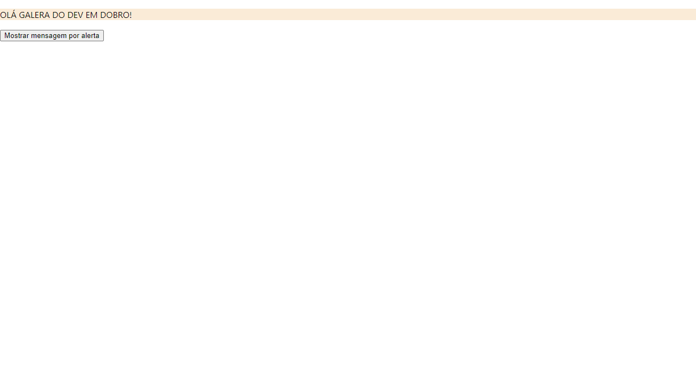

<h1 align="center">
  Desafios 1 & 2 <br/> ⚔️ Quest React Base ⚔️
</h1>
<p align="center">
  Projeto de <a href="https://jonathanbenedito.github.io/quest-react-base/" target="_blank">website</a> feito para a uma quest do curso <a href="https://www.linkedin.com/school/devquest-dev-em-dobro/">DevQuest - Dev em Dobro</a>, um paragrafo que transforma texto em maiúsculo e um simples botão de alerta.
</p>




## 💬 Sobre

### O Desafio

Esse projeto é uma compilação de 2 desafios propostos pela quest do curso:

- 1º Desafio: Criar um componente que colore a tag paragrafo `<p>` e transforme as letras do seu conteúdo em maiúsculas. As cores e o texto deverão ser passadas pelas `props`.

- 2º Desafio: Criar um componente `<button>` com um evento de clique que mostre um alerta com a seguinte mensagem: "A label desse botão é " + o valor informado pelaa prop label do botão que foi clicado.

## 🛠 Guia de instalação

1. Faça o clone do projeto
    ```
    git clone https://github.com/jonathanBenedito/quest-react-base.git
    ```

2. Acesse o repositório
    ```
    cd projeto-fetch-github-api
    ```

3. Instale o pacote do projeto
    ```
    npm install
    ```

4. Inicialize o app
    ```
    npm start
    ```

### 🔗 Links

Website: <a href="https://jonathanbenedito.github.io/quest-react-base/" target="_blank">jonathanbenedito.github.io/quest-react-base</a>

DevQuest - Dev em Dobro (Linkedin): <a href="https://www.linkedin.com/school/devquest-dev-em-dobro/" target="_blank">linkedin.com/school/devquest-dev-em-dobro/</a>

### 🧱 Tecnologias

O website foi construído usando React JS, efetuado os testes com JEST  e React Testing Library.

<div style="display: flex; margin-top: 15px; gap: 20px;">
  
  
          
</div>